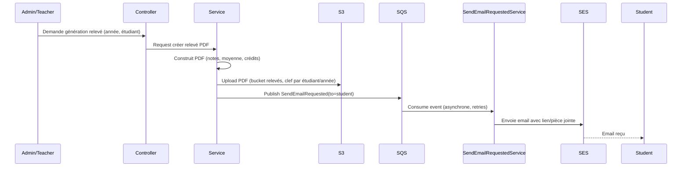
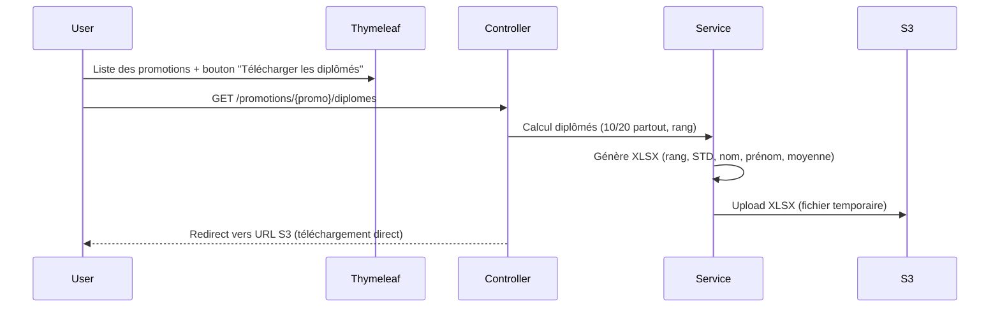

# Architecture technique

## 1. Stack

| Composant | Technologie |
|-----------|-------------|
| Backend | Spring Boot 3.2.2 (Java 21) |
| Base de données | PostgreSQL (à ajouter — JPA/Hibernate) |
| Front | Thymeleaf + Spring MVC (à ajouter) |
| Sécurité | Spring Security + JWT (à ajouter) |
| Stockage fichiers | AWS S3 (`BucketComponent`, déjà présent) |
| Emails asynchrones | AWS SQS + SES (`SendEmailRequested`/`Mailer`, déja présents) |
| PDF relevés | OpenPDF / pdfbox (à ajouter) |
| XLSX diplômés | Apache POI (à ajouter) |

Le squelette est un template **Poja** : endpoints REST dans `endpoint/rest`, événements asynchrones dans `endpoint/event`, services dans `service`, stockage S3 dans `file/bucket`, email dans `mail`.

## 2. Organisation des couches

```
src/main/java/api/poja/app/
├── endpoint/rest        → Controllers Spring (Spring Security + Thymeleaf views)
├── endpoint/event       → Événements async SQS (SendEmailRequested) + consumers
├── service              → Logique métier (notes, moyennes, diplômés)
├── service.event        → Consumers SQS (ex. SendEmailRequestedService)
├── repository           → JPA repositories (à créer)
├── model                → Entités JPA (à créer)
├── file/bucket          → BucketComponent (upload S3, déjà présent)
├── mail                 → Mailer (envoi email via SES, déjà présent)
└── concurrency          → Workers (traitement en parallèle)
```

La génération de code se fait aussi via **OpenAPI** (`api.yml`), le template générant les endpoints dans `endpoint/rest`.

## 3. Flux — Relevé de notes (PDF par email, asynchrone)



## 4. Flux — Liste des diplômés (XLSX, téléchargement direct)



## 5. Points d'attention

- **Notes historisées** : toute modification crée une entrée d'historique (pas de mise à jour destructive).
- **Parcours EL/TN** : les requêtes de bulletin filtrent strictement les cours du parcours de l'étudiant.
- **Groupes non fixes** : les notes sont rattachées à l'étudiant via inscription groupe/semestre, jamais perdues.
- **Coefficients** : somme des coefficients des examens d'une matière = 1 (représentation décimale ou fractionnaire).
- **Async** : les envois d'emails passent par SQS (pas de blocage du thread HTTP).
- **Sécurité** : chaque endpoint vérifie le rôle (Student/Teacher/Admin).