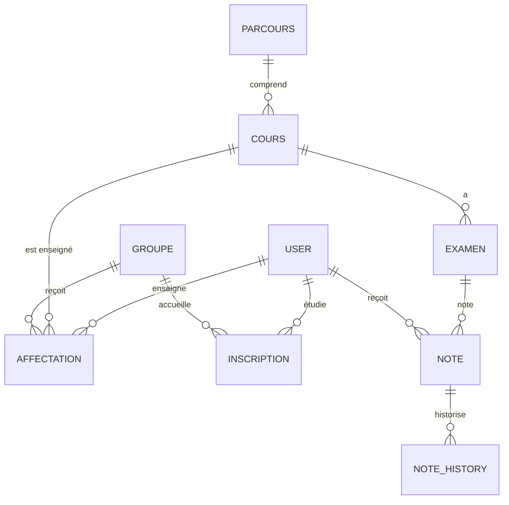

# Modèle de données

## 1. Diagramme (vue simplifiée)

## 2. Entités

### User
- `id` (UUID)
- `std` (code étudiant, ex. STD12345) — nullable pour teachers/admins
- `nom`, `prenom`
- `email`
- `password` (hash)
- `role` : `STUDENT` | `TEACHER` | `ADMIN`
- `parcours` : `EL` | `TN` (pour les students)

### Cours
- `id` (UUID)
- `ref` (ex. PROK1, WEB1, WEB2, WEB3, PROK4, CQ1)
- `intitule`
- `credits` (int)
- `parcours` : `EL` | `TN` (cours typé par parcours ou partagé)
- `semestre` (1 à 6)

**Règles** : 30 crédits par semestre, 60 crédits par année.

### Groupe
- `id` (UUID)
- `ref` (ex. K1, K2, K3, K4)
- `annee` (année du groupe)

### Parcours
- `id` (UUID)
- `code` : `EL` | `TN`
- `nom`
- Relation `cours` (liste des cours du parcours)

### Examen
- `id` (UUID)
- `cours` (FK)
- `date`, `heure`
- `coefficient` (decimal, ou représentation fractionnaire)

**Règle** : pour un cours donné, `SUM(coefficient des examens) = 1`.

### Affectation (cours → groupe × prof × année)
- `id` (UUID)
- `cours` (FK)
- `groupe` (FK)
- `teacher` (FK User)
- `annee`

> Permet : un cours enseigné par plusieurs profs, des profs assignés chaque année, des cours différents selon les groupes/parcours.

### Inscription (étudiant → groupe, période)
- `id` (UUID)
- `student` (FK User)
- `groupe` (FK)
- `semestre`, `annee`

> Modélise la **mobilité des groupes** : un étudiant en changeant de groupe garde toutes ses notes rattachées à la période/inscription.

### Note
- `id` (UUID)
- `student` (FK)
- `examen` (FK)
- `inscription` (FK — groupe où la note a été prise)
- `valeur` (decimal 0–20)
- `version` (pour l'historisation)
- `date_creation`

### NoteHistory
- `id` (UUID)
- `note` (FK)
- `ancienne_valeur`, `nouvelle_valeur`
- `date_modification`
- `modifie_par` (FK User)

> Toute correction de note (réclamation) insère une ligne ici — **les notes sont historisées**.

## 3. Règles de gestion à implémenter

| # | Règle | Implémentation |
|---|-------|----------------|
| 1 | Diplôme = 10/20 à tous les cours du parcours | Agrégation par étudiant sur les notes finales de chaque cours |
| 2 | Moyenne générale sur 3 ans | Moyenne pondérée (crédits + coefficients) des notes finales |
| 3 | Bulletin = uniquement les cours du parcours de l'étudiant | Filtrage via `Cours.parcours` == `Student.parcours` |
| 4 | Notes conservées malgré les changements de groupe | Rattachement aux `Inscription` |
| 5 | Notes historisées | Table `NoteHistory` à chaque modification |
| 6 | 30 crédits/semestre, 60/an | Validation sur le seed + règles de calcul |
| 7 | Somme coefficients = 1 par cours | Contrainte de validation |
| 8 | Relevé provisoire vs complet | Champs `provisoire`/statut + moyenne/crédits calculés |

## 4. Calculs

- **Note finale d'un cours** (pour un étudiant, une année) : `SUM(examen.coefficient × note.valeur)` sur les examens de ce cours.
- **Moyenne générale d'un étudiant (année)** : pondérée par les crédits des cours validés du parcours.
- **Rang** dans la liste des diplômés : classement par moyenne générale décroissante.
- **Nombre de crédits** : somme des crédits des cours suivis avec note ≥ 10.